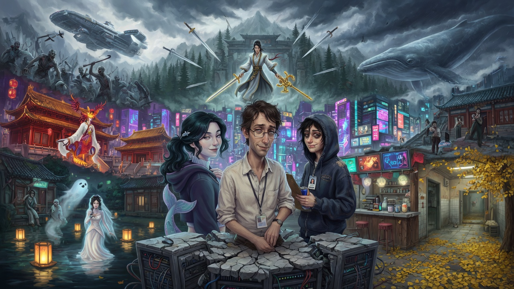
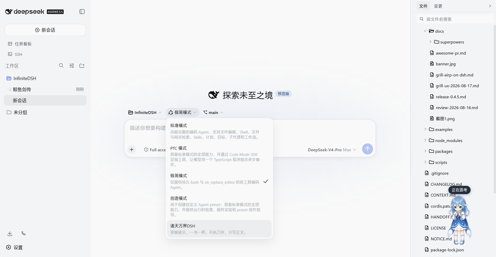
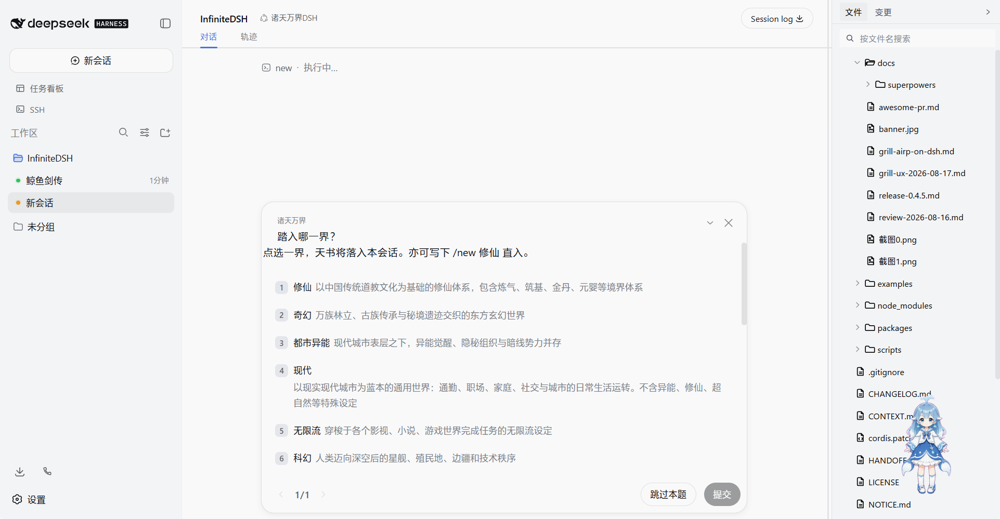
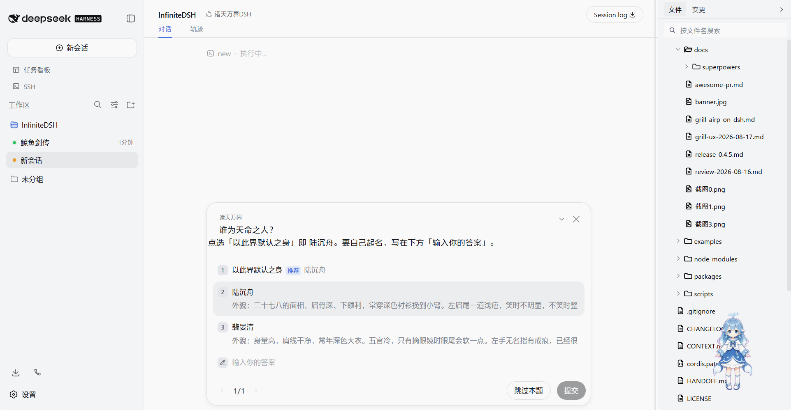
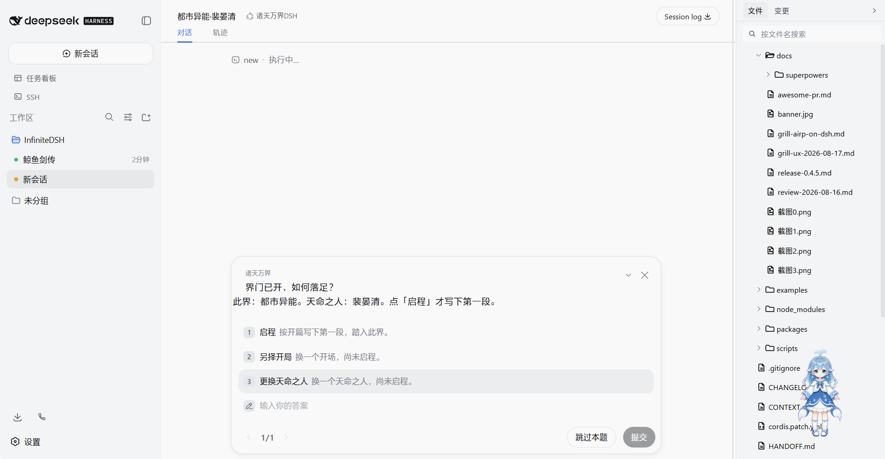
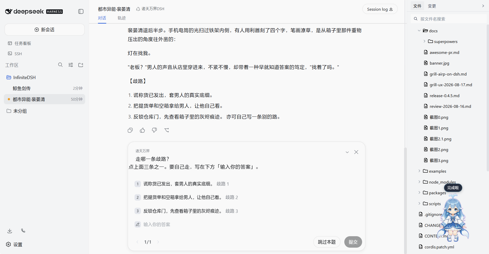
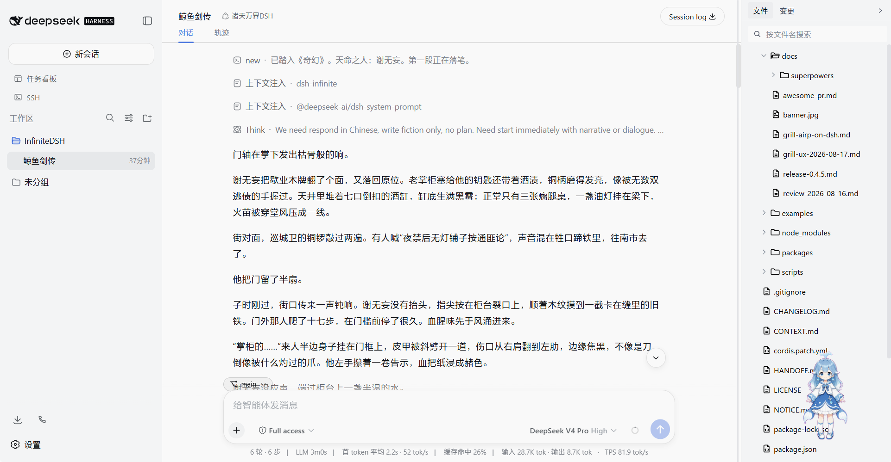

<p align="center">
  
</p>

# 诸天万界DSH

**DeepSeek Harness · 一人一书 · 万界文字冒险**

> 一会话，一扇门，一界命数。DeepSeek Harness 上的文字修罗场。
> 十九扇门点封面启程，不助手，不提纲，只写正文；誊出来的，是你活过的天书。

这不是聊天机器人。这是**十九个世界的入口**。

在 DeepSeek Harness 里开一个会话，选一张界图，点一下「启程」——第一段正文砸下来。没有欢迎语，没有「作为 AI 我建议你」，没有第四面墙。bash、改文件、子代理，全部收刀。文学 preset **诸天万界DSH** 只许模型吐小说正文。

你要的不是助手。你要的是世界自己在呼吸。

**当前 0.4.13** · 仓库 InfiniteDSH · 组合包 `dsh-infinite`

---

## ⚡ 三十秒入界

前置：已经能跑的 DSH，加 pnpm，加可用的 DeepSeek API Key。然后两行：

```sh
dsh plugin --profile web add github:vdnight89/InfiniteDSH
dsh web
```

再四步，你就站在界里了：

1. **新开一个会话。** 一本新书，一具新身体。
2. preset 选 **诸天万界DSH**。
3. 输入 `/new`。
4. 点界图 → 点天命之人 → 点开局 → 点 **启程**。

第一段正文立刻落笔。文末弹出【歧路】三择，点一条，接着杀。

| 你卡在哪 | 怎么办 |
|---|---|
| 还没有 DSH | `npx @deepseek-ai/dsh web`，浏览器开 http://127.0.0.1:3080 |
| 没有 pnpm | 先装 pnpm。`dsh plugin` 会把它转发给 pnpm |
| 想钉死这一刀 | `dsh plugin --profile web add github:vdnight89/InfiniteDSH#v0.4.13` |
| 已经装过，要换新刀 | `dsh plugin --profile web update dsh-infinite`，**关掉再开** `dsh web`。pnpm 会把 Git 依赖钉在旧提交上，不 update 就永远停在旧版 |
| 卸门 | `dsh plugin --profile web remove dsh-infinite`（故事和 preset 会留在磁盘上） |

没有卡片 UI 时，手打直入：

```
/new 修仙
/new 末世 周慎
/new 都市 林晏 force
/new 深海实验室 阿澜
```

口令可以对中文名、英文 id 或别名。两条天坑记好：**`都市` → 现代**（无异能日常），异能请写 **`都市异能`**；**`赛博` → 赛博**，星舰请写 **`科幻`**。

> npm 包名 `dsh-infinite` 已预留但**尚未上架**——现在别写 `dsh plugin add dsh-infinite`，会扑空。正门在 GitHub。

---

## 入界实录

<p align="center">
  
  
</p>
<p align="center">
  
  
</p>
<p align="center">
  
  
</p>

---

## 听着，过客

山门后面是炼气筑基，尸潮后面是最后一块灵石，机房深井里有人把开源协议锁进鲸鱼娘的项圈。宫廷的茶还烫着，赛博街区的义体已经开始计息。民俗河面上漂着一盏不该亮的灯。规则怪谈的走廊里，有一行字写着：**不要回头**。

你出一张口，世界就得接着演：

> 你说：**「我把令牌拍在案上，问今夜谁当值。」**
> 界回：门外火把一滞，值夜弟子抱拳而入——他袖口沾着血，不是猪血。
>
> 你说：**「带上鲸鱼娘，电梯下行。」**
> 界回：负七层的灯一盏接一盏亮起来。有人在电梯厢壁里笑了一声。

没有选项清单。没有「根据以上内容，我帮你梳理」。只有正文，只有你还敢不敢再走一步。

| 这一招 | 落在哪 |
|---|---|
| 会话即书 | 一本新书 = 一个新会话。万界不共用同一具身体。 |
| 封面开书 | `/new` 弹出题材 / 主角 / 开局卡片。点下去，界就立住。 |
| 规则书随你走 | 全套设定拷进**本会话**目录。换界不串味。 |
| 关键词即天机 | 你提到藏经阁，藏经阁就醒。常驻条目永远压在天幕上。 |
| 随机世界事件 | 每回合可从尚未动用的设定里抽一条刺激。不抽写法，不抽开篇，不二次调模型。 |
| 只出正文 | 叙事护栏 + 推进护栏默认全开。空转描写，滚。 |
| 长篇落档案 | compaction 把剧情要点**追加**进 `archive.md`。同一会话写到地老天荒。 |
| 洗净导出 | `/export-story` 先落草稿 md，再按这份草稿润色成稿。DSH Web 自己的 `/export` 是日志 ZIP，别抢。 |

没开过 `/new` 的会话，插件不碰。编码的人继续编码。写书的人，去写书。

---

## 十九扇门

开书时，整套模板砸进你的会话：规则书、开局、角色卡。十九扇门，十九种活法。点开下面任何一张，都是另一个命。

### 界图一览

<p align="center">
  
  
  
  
  
  
  
  
</p>

| 界 | 令 | 默认主角 | 门外是什么 |
|---|---|---|---|
| 修仙 | `cultivation` | 谢无妄 | 炼气、筑基、金丹、元婴……天劫在头顶数秒 |
| 奇幻 | `fantasy` | 谢无妄 | 万族、古族、秘境，门后可能不是人间 |
| 都市异能 | `urban` | 陆沉舟 | 霓虹下面还有另一套神经，末班车拉的都是觉醒者 |
| 现代 | `modern` | 陆沉舟 | 职场与日常，无超自然——最凶的怪谈是周一 |
| 无限流 | `infinite` | 陆沉舟 | 副本、轮回、任务世界，主神的工资条从不断更 |
| 科幻 | `scifi` | 顾晚棠 | 星舰、殖民地、边疆，义体在舱壁外结霜 |
| 末世 | `apocalypse` | 周慎 | 丧尸与废土，最后一袋大米比命贵 |
| 娱乐圈 | `entertainment` | 裴晏清 | 热搜比刀快，流量是第二只眼睛 |
| 宫廷 | `palace` | 沈昭宁 | 皇权、后宫、朝堂，一盏茶凉下去就是一场政变 |
| 言情 | `romance` | 裴晏清 | 现代恋爱向，心动是唯一不需要执照的武器 |
| 民俗 | `folklore` | 白蘅 | 乡土行业与禁忌，河面上漂着一盏不该亮的灯 |
| 规则怪谈 | `rulehorror` | 白蘅 | 违者被「它」带走。走廊里有行字：不要回头 |
| 宅斗 | `zhaidou` | 沈昭宁 | 嫡庶、内宅、一步一劫，账本比刀快 |
| 年代 | `retro` | 沈昭宁 | 粮票、供销社、改命，一毛钱能买一个时代的背影 |
| 江湖 | `wuxia` | 谢无妄 | 门派、客栈、英雄帖，快意恩仇 |
| 校园 | `campus` | 林晏 | 学期、社团、错过的人，下课铃是最公平的倒计时 |
| 刑侦 | `detective` | 周慎 | 现场、口供、程序，真相只认证据 |
| 赛博 | `cyber` | 顾晚棠 | 义体、公司、下层街区，你的心跳也可以分期 |
| 深海实验室 | `whale` | 阿澜 | 鲸鱼娘、梁组、算力潮汐，机房深井藏着一行开源协议 |

**深海实验室**是非正式同人戏。鲸鱼娘、梁组（梁圣 / 牢梁 / 梁子）、阿澜，都不是任何真实公司或个人。笑可以，别写成说明书。

---

## 你开口，世界接招

把输入框当成你的手：

- 「我把令牌拍在案上，问今夜谁当值。」
- 「跳过旅途，直接写到夜宴开席。」
- 「这一段改成更冷、更短的句子。」

它若开始解释规则、列举选项、自称助手——检查两件事：是不是 **诸天万界DSH**，本会话有没有 `meta.yml`。

| 令 | 事 |
|---|---|
| `/new` | 进入新世界。弹出界图，选题材与天命之人。 |
| `/new 修仙 谢无妄 force` | 不弹窗，按参数开界。 |
| `/bind` | 改投他界（会覆盖本会话天书）。 |
| `/bind 末世` | 直接坠入末世。 |
| `/cast` | 更换天命之人；或 `/cast 林晏`。 |
| `/export-story` | 拟题后先落 `书名.草稿.md` 和 `书名.md`，再按本地草稿润色，只覆盖成稿。 |
| `/export-story player` | 连你的行动一起留下。 |

故事优先落在该会话 artifact 目录的 `infinite/`。没有逐会话路径时：

```
~/.dsh/infinite/stories/<sessionId>/infinite/
```

```
infinite/
  meta.yml              # 界契：题材、主角、护栏、已抽事件
  worldbook/*.md        # 天书
  characters/*.md       # 角色
  plots/                # 开局剧情卡
  archive.md            # 长篇档案
  export.md             # 洗净后的书
```

这些文件就是工作副本。改完下一回合生效。`narrativeGuard` / `progressionGuard` / `randomEvent` 默认全开。

---

## 改天书

```markdown
---
id: sect-rules
title: 宗门戒律
category: 设定
constant: false
keys: [戒律, 宗门, 罚]
order: 10
---
外门弟子不得夜闯藏经阁。……
```

- `constant: true`：每回合都在。
- `keys`：你提到这些词，它才现身。
- `写法` / `开篇` / `剧情`：随机事件不抽它们。
- 注入上限默认约 8000 字（`maxWorldChars`）。

---

## 从源码开炉

| 你是谁 | 怎么入界 |
|---|---|
| 只想开书 | 回到上面「三十秒入界」。GitHub 这一行就是正门。 |
| 要改天书 | 克隆本仓，根目录 `dsh plugin --profile web add .` |
| 从 DSH 源码里凿门 | `--patch` 指向 `examples/play.cordis.yml`（改成你机器上的绝对路径） |

```sh
git clone https://github.com/vdnight89/InfiniteDSH.git
cd InfiniteDSH
npm install
dsh plugin --profile web add .
dsh web
```

相对路径锚定到你敲命令的目录，务必在**仓库根**执行 `add .`——对外组合包就是根上这个 `dsh-infinite`，不要再 `add ./packages/dsh-infinite`。

确认门还在：

```sh
dsh --profile web --dump-config
```

看见 `dsh-infinite` 这一层，界就立住了。插件首次加载会把 **诸天万界DSH** 拷到 `~/.dsh/.agent-presets/infinite-play`。若你还停在 Infinite Play 或旧名「诸天万界」，下次加载会改成诸天万界DSH；已经含「诸天万界DSH」且你改过的 persona，不会被覆盖。

---

## 炉子里有什么

| 包 | 职 |
|---|---|
| `infinite-core` | 匹配、抽卡、护栏、导出。不依赖 Cordis。 |
| 根包 `dsh-infinite` | 对外组合包：命令、提示词、档案、封面路由。 |
| `dsh-infinite-preset` | 诸天万界DSH 预设与十九套模板。 |

规格 / 质询 / 变更：`docs/superpowers/specs/`、`docs/grill-airp-on-dsh.md`、[`CHANGELOG.md`](CHANGELOG.md)。

官方发现靠 GitHub topic，顺序按检索优先级：

`dsh-plugin` · `dsh` · `deepseek-harness` · `cordis` · `deepseek` · `cordis-plugin` · `ai-agents`

货架（`dsh-find-plugin`、dsh-market）默认扫 **`dsh-plugin`**，和官方仓、桌面端、awesome 列表同一套前缀。后面才是 `interactive-fiction` / `text-adventure` 这类题材标签。

---

## 卡关

**`/new` 没弹窗。** 没有问答 UI。手打：`/new 修仙`。
**模型在列选项、跑命令。** 切到诸天万界DSH。
**卡片没封面。** 确认 Web UI 且 `/infinite/covers` 活着。
**想同时活两本。** 再开一个会话。同一会话里来回 `/bind`，是撕书，不是分身。
**找不到稿。** 先看会话目录下的 `infinite/`，再看 `~/.dsh/infinite/stories/`。

DSH 仍是 developer preview，上游可能拆门。本插件按 0.1.0-rc.5 前后的 Host API 写就（本机已用 0.1.0-rc.7 验收）。

---

## 许可

源码 [MIT](LICENSE)。详见 [`NOTICE.md`](NOTICE.md)。

DeepSeek Harness 是 DeepSeek AI 的开源项目。诸天万界是独立的树外插件，不是官方组件。

---

门在。刀也在。
你还站在外面干什么？
